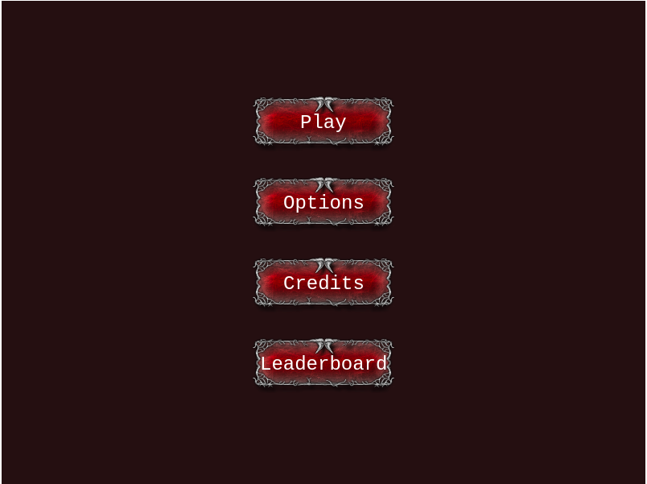
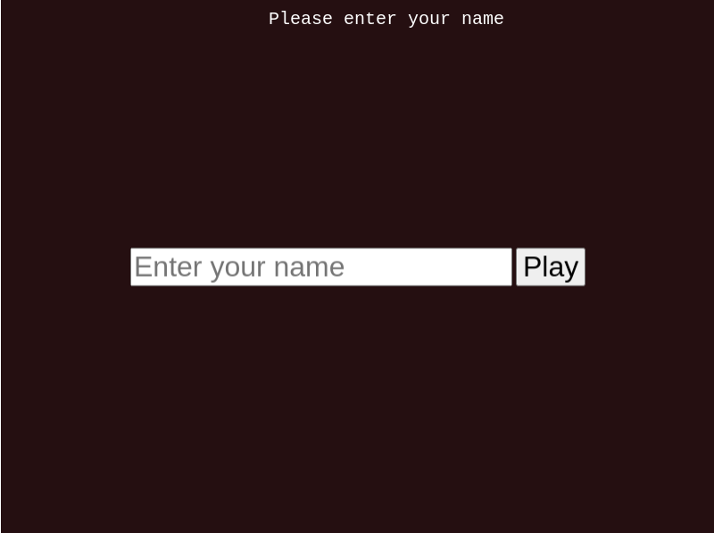
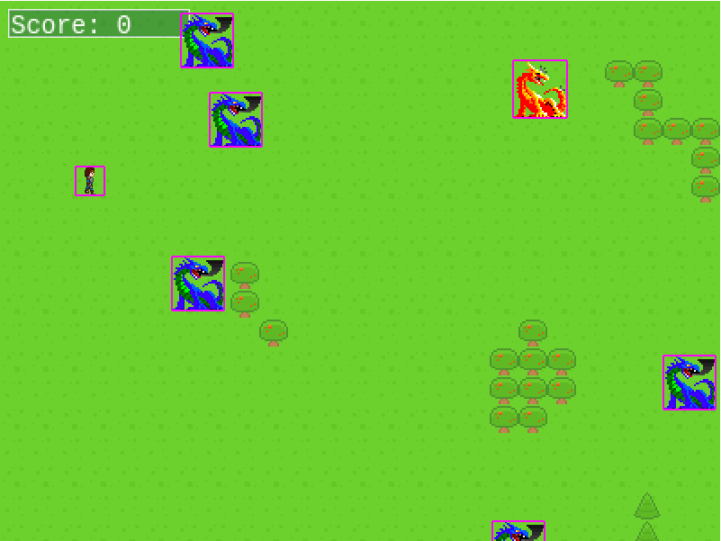
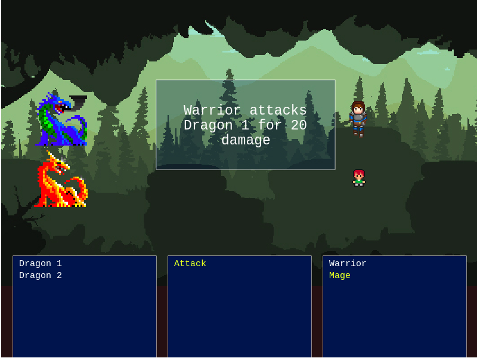
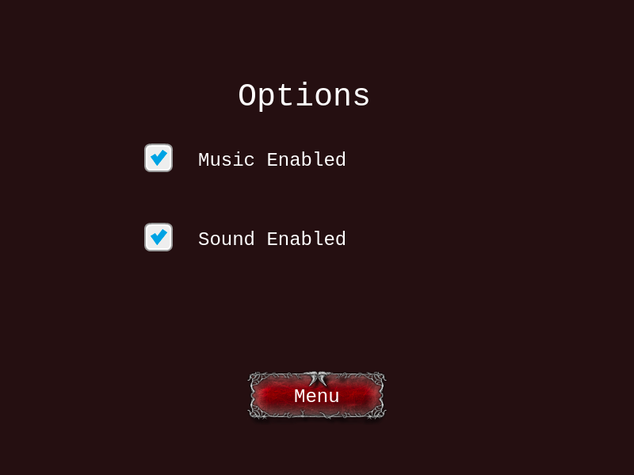
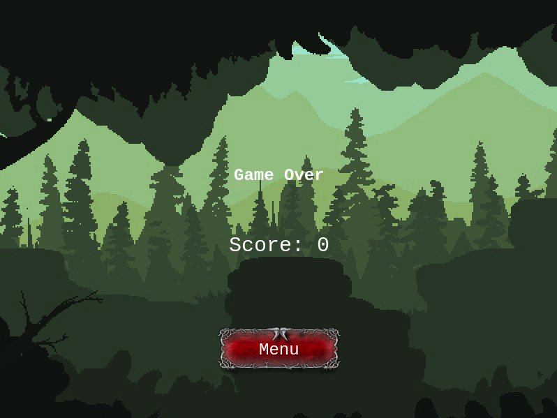

# Turn-Based RPG Game
## About
Dragon Fighter is a turn based RPG game. The objective of the game is to kill as many dragons as possible

## Game
A warrior wants to defeat all the dragons in the world as thye are destroying everything on their way. 

A warrior will lead and search for the dragons and whenever he meets a dragon his friend mage will come to help him to defeat the dragons.

## How to Play
### Movement in the world 
To move around the world you can use arrow keys on the keyboard.
Left arrow key - move player to the left
Right arrow key - move player to the right
Up arrow key - move player up
Down arrow key - move player down

#### Attack 
Left arrow / Space key - attack dragon (See the description bellow when you can attack this line)

### Battle
When you meet a dragon the scene will switch to the battle scene. On the right side of the screen there will be two dragons, and on the left side a Warrior and Mage. You will start of with the Warrior, to attack you can click left arrow key or space button on the keyboard. Also you can choose which dragon to attack by clicking arrow up and down keyboards.

When the battle is over and if you defeat the dragons you score will be increased and scene will switch back to world scene. However, if you loose the battle the scene will switch to the game over scene.

### Screenshots of Scenes 









## Built With
* JavaScript, Phaser 3
* Webpack, Eslint, Jest

## Run Locally
To get a local copy up and running follow these simple example steps.

> Clone project to your local machine
```bash
git clone git@github.com:Abdusaid10/game-rpg.git
```

> Go to the newly created folder
```bash
cd game-rpg
```
> Install dependencies
```bash
npm install
```
> Build project
```bash
npm build
```
> Run Locally
```bash
npm run dev
```

> Open in browser
```bash
  http://localhost:8000/
```
> Run Tests
```bash
npm test
```
## Author

-[Abdusaid Abdurasulov](https://github.com/Abdusaid10)

## Contributing
Contributions, issues and feature requests are welcome!

Feel free to check the issues page.
## Links
[Jest Getting Started](https://jestjs.io/docs/en/getting-started)

[Webpack configuration of loaders](https://webpack.js.org/guides/getting-started/)

[Configuration of jest](https://jestjs.io/docs/en/webpack)

[Phaser 3 examples](https://phaser.io/examples)

[Turn Based RPG Game Tutorial](https://gamedevacademy.org/how-to-create-a-turn-based-rpg-game-in-phaser-3-part-1/)

[Phaser 3 Template](https://phasertutorials.com/creating-a-phaser-3-template-part-1/)

[Assets can be found here](https://opengameart.org/)

## License
This project is [MIT](https://github.com/Abdusaid10/game-rpg/blob/master/LICENSE) licensed.